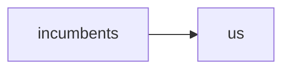

# Company dossier

Run: `run-golden`
Idea: A solar-powered cold chain for rural pharmacies
Config: depth standard · languages en, es · score gate 9.5 · strategy angle none

## Contents

- Market Analysis (`market-analysis`) — English, Spanish
- Competitor Analysis (`competitor-analysis`) — English
- Brand Identity (`brand-identity`) — English
- Pricing Strategy (`pricing-strategy`)
- Localisation (`localisation`) — German, Hindi

Cross-references: every prompt and response verbatim in the run log (`run-log.md`).

---

## Market Analysis (`market-analysis`)

### English

```
Verdict: the cold chain wins on unit economics — pharmacy margins absorb the capex.
```

### Spanish (`es`)

```
Veredicto: la cadena de frío gana en economía unitaria.
```

---

## Competitor Analysis (`competitor-analysis`)

### English

````

````

---

## Brand Identity (`brand-identity`)

### English

```
Palette: solar amber on clinical white; wordmark set in a grotesque.
```

---

## Pricing Strategy (`pricing-strategy`)

> MISSING: the winning improved draft for this stage was not found in the store (stage status: done).

---

## Localisation (`localisation`)

### German (`de`)

```
Lokalisierte Fassung des Dossiers.
```

### Hindi (`hi`)

```
लोकल की गई फाइल।
```
